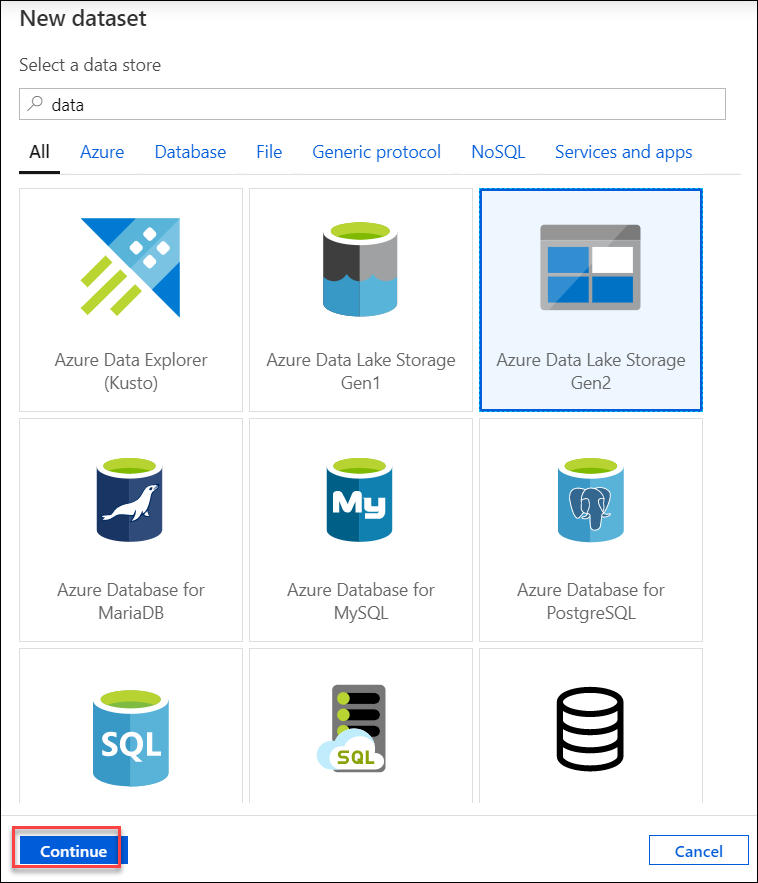
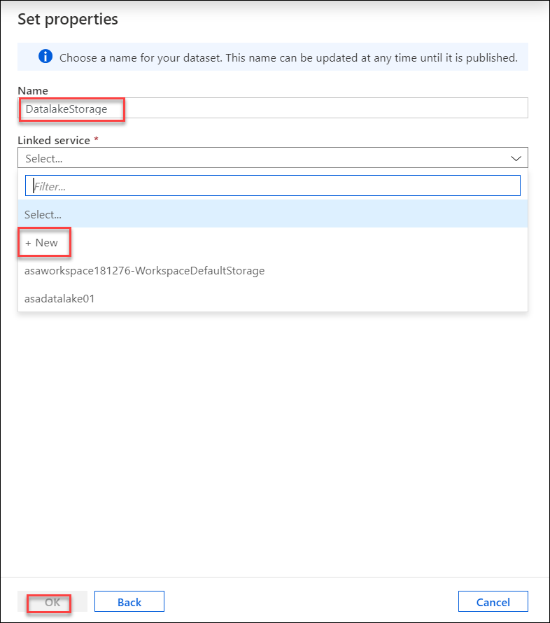
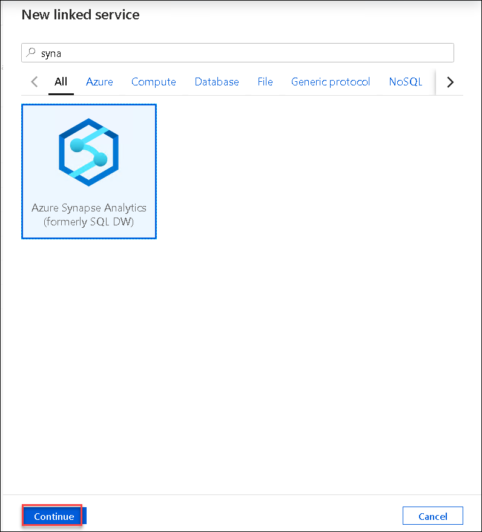
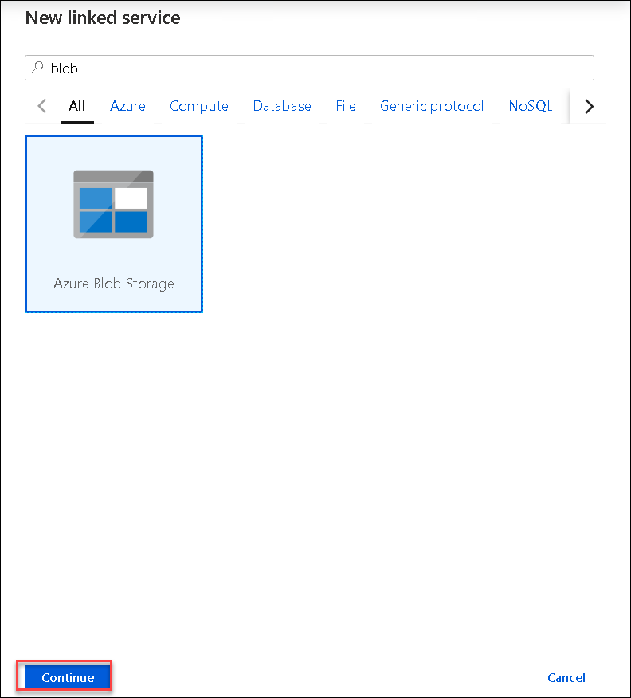
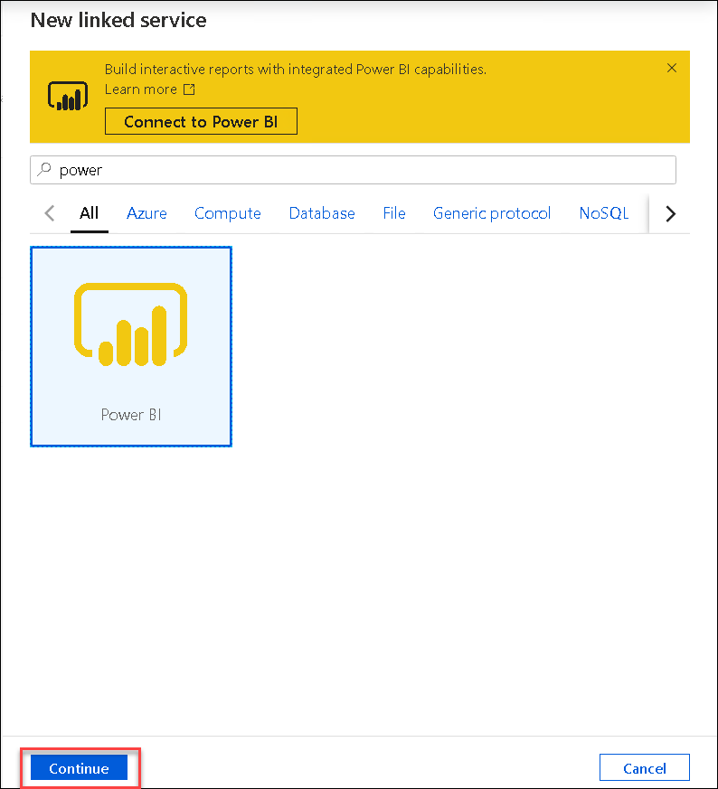

## Exercise 1: Create the Linked services in the Synapse Workspace

Duration: 10 minutes

Before moving ahead, Verify that **SQL Pool and Spark Pool** are created.

   

**Note**: **Ensure to create the linked services with the same name as mentioned in the lab instructions.**

### Task 1: Create the ADLS Gen2 linked service
Within the Azure Portal, navigate to the resource group named synapse and then select the synapse workspace named labworkspace.

1. From the Synapse Workspace click on **Launch Synapse Studio** from the top right corner

   

2. Create **ADLS Gen 2** linked service by clicking on **Data** on the Left Pane and then click on **+->Dataset**

   
   
3. Select the **Azure Data Lake Storage Gen2** and click on **continue**.
 
   
   
4. Select the format as **Parquet** and click on **Continue**
 
   
   
5. Provide the name as **Datalakestorage** then Click on **+New** to create linked service
  
  

6. Provide the following details :

   - Name : **CoreDataLakeStorageBackup**
   
   - Select the subscription where the ADLS storage account is deployed
   
   - Select the ADLS Storage account
   - Test the connection and then click on **create**. 
   - Click on **Ok** in the previous **SetProperties** page

   

### Task 2: Create the Azure Synapse Analytics linked service
	
 1. Click on **+New** under the Manage Section->Linked Services & select **Azure Synapse Analytics** for creating Synapse Analytics linked service and click on **continue**.
 
    

 2. Provide the following details:
    - Name : **CoreSQLPoolBackup**
    - Select Enter manually 
    - Fully qualified domain name: **labworkspaceXXXXXX.database.windows.net** where xxxxxx is the deployment id,copy the value of Deployment ID from the environment details page and ensure to replace it in the place of xxxxxx
    - Database name: **sqlpool**
    - Authentication type: SQL authentication
    - User name: **sqladmin**
    - Password: **IgniteRocks!!7112019**
    - Test the connection and click on **create**

    

### Task 3: Create the Azure Open Dataset linked service

1. Again, Click on **+New** under the Manage Section->Linked Services and select **Azure Blob Storage** for creating Azure Open dataset Linked service.

   

2. Provide the following details
    - Name : **Azure OpenDataset**
    - Authentication Method : SAS URI
    - SAS URL : https://azureopendatastorage.blob.core.windows.net/
    - SAS Token :“”
    - Test the connection and click on **create**
    
   
  
### Task 4: Create the Power BI linked service

   Inorder to create Power BI linked service firstly you need to create a PowerBI workspace.

1. Create a Power BI workspace
   - Login to http://app.powerbi.com/  using your credentials from the environment details page.
   - Navigate to Workspaces -> Create a workspace
   
   

   - Create a PowerBI workspace and name it **labignitePBIxxxxxx** where xxxxxx is the deployment id,copy the value of Deployment ID from the environment details page and ensure to replace it in the place of xxxxxx
   - Click on **Save**
   
   
     
2. Now create a PowerBI linked service

   - Click on **+New** under the Manage Section->Linked services and select **Power BI** for creating Power BI linked service.
       
   
   
 3. Provide the following details
 
     - Name : **labignitePBI**
     - Select your PBI workspace which you created in the previous step
     - Click on **create**
  
    
    
    Click **Next** to go to the next exercise.
