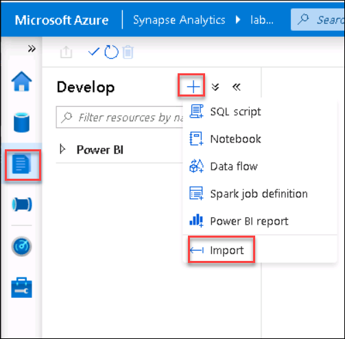

## Exercise 2: Import all the artifacts and set the credentials for SQL Pool and SQL ON DEMAND in the Synapse Workspace

Duration: 05 minutes

### Task 1: Import all the SQL scripts and notebooks

1. Navigate to **Develop** by clicking on develop button the left side of the page as shown and then Click on **+**.Then Click on **Import** to import all the **SQL scripts**.

   
   
2. Browse to the folder where the lab files are downloaded.

   - Navigate to **C:\LabFiles\Building-an-end-to-end-analytics-pipeline-in-Microsoft-Azure-master\labfiles\SQL Scripts**
   - Select all the **SQL scripts** to import.

3. Return to **Develop** and then click on **+** .Then Click on **Import** to import all the **Notebooks**.

   
   
4. Browse to the folder where the lab files are downloaded.
   
   - Navigate to **C:\LabFiles\Building-an-end-to-end-analytics-pipeline-in-Microsoft-Azure-master\labfiles\Notebooks**
   - Select all the **notebooks** to import.
   
5. Once you finish importing all the SQL scripts and the notebooks, Click on **publish all** then Click **Publish**
   
   
   
### Task 2: Set the credentials for SQL Pool

1. Now you will execute the SQL script **EXE2 SQLPoolcredentials SETUP ONLY** by doing the following steps
     
    - Navigate to **Develop->SQL Scripts** and select the SQL Script **EXE2 SQLPoolcredentials SETUP ONLY** which you imported in task 1
    - **EXE2 SQLPoolcredentials SETUP ONLY** SQL script is to assign the role of Database owner to the user.
   - **Copy the username** from the environment details page and replace it in the script.
    - Ensure to **connect to sqlpool** and not sql on demand
    - Click on **Run** and the output should show as command executed successfully.
    - And **publish** the changes.
    
    
    
    
### Task 3: Set the credentials for SQL on-demand
   
1. Now you will execute the SQL script **EXE2 SQLODStorageCredentials SETUP ONLY** by doing the following steps
    
    - Navigate to **Develop->SQL Scripts** and select the SQL Script **EXE2 SQLODStorageCredentials SETUP ONLY** that you imported in task 1.
    - Copy the Storage account name from the environment details page and **replace the Storage account name** in the script
    - Ensure to connect to **sqlondemand** and not sqlpool
    - Click on **Run** and the output should show as command executed successfully.
    - And **publish** the changes.
    
    
  

2. Now you will execute the SQL script **EXE2 SQLODCredentials SETUP ONLY**   

    - Navigate to **Develop->SQL Scripts** and select the SQL Script **EXE2 SQLODCredentials SETUP ONLY** that you imported in the task 1.
   - **Copy the username** from the environment details page and replace it in the script.
   - Ensure to connect to **sqlondemand** and not sqlpool
   - Click on **Run** and the output should show as command executed successfully.
   - And Click on **publish** to save the changes.
 
    
    
    Click **Next** to go to the next exercise.
