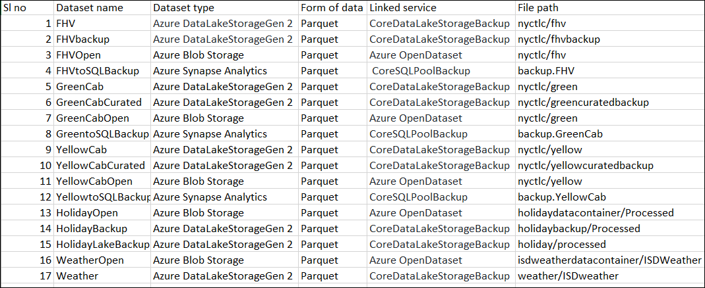

## Exercise 3: Create Schemas, Tables, Stored Procedures and Datasets for SQL Pool.

Duration: 20 minutes

### Task 1: Create Schemas in SQL Pool.

1. Now you will create **Staging** schema by doing the following steps

    - Navigate to **Data** from the synapse studio -> Databases ->**SQL Pool**->**Schemas**->**New SQL Script**->**New Schema**
    - **Run** the command **CREATE SCHEMA [Staging]**.
  
    
  
2. Now you will create **Backup** Schema by doing the following steps

    -  Navigate to **Data** -> Databases ->**SQL Pool**->**Schemas**->**New SQL Script**->**New Schema**
    - **Run** the command **CREATE SCHEMA [Backup]**.
    - **Publish** the changes made after creating both the schemas.
   
   
### Task 2: Create Tables in SQL Pool.
 
 1. Navigate to **Develop->SQL scripts**, Select and execute the SQL script **EXE3 CreateStagingBackupTables SETUP ONLY** that you imported in the previous exercise.Ensure you are connected to **sqlpool**
 
 2. Click on **Run**
 
 3. Go to **Data-> Databases->Sql pool->tables** to verify whether the tables are created .Refresh if you don't see the tables
 
    

 
### Task 3: Create Stored Procedures in SQL Pool.
 
1. Navigate to **Develop->SQL scripts**, Select and execute the SQL script **EXE3 CreateStoredProcedures SETUP ONLY** that you imported in the previous exercise. Make sure you are connected to **sqlpool**

2. Click on **Run** 

3. Go to **Data-> Databases->Sql pool->Progammability->Security->Stored Procedures** to verify whether the stored procedures are created .Refresh if you don't see the stored procedures

   

### Task 4: Create Datasets for the pipeline.

1. Navigate to Data->**+**->**Dataset**

   

2. Now you will create **FHV Dataset**.

   - Search for **ADLS Data Lake Storage Gen 2** and Click on **Continue**.

   

   - Select **Parquet** as format of data and click continue.

   
 
   - Under Set Properties provide the name as **FHV**
   
   - Select the previously created Linked Service **CoreDataLakeStorageBackup**
   
   - Browse to the File Path nyctlc/fhv
   
   - Click on **OK**,the first dataset is now created

   

3. Similarly as shown in  step 2 create another 16 datasets by following the below list.

   **Note**: Please enter the file path information manually for the datasets that uses Azure Blob Storage and the Azure Open Dataset linked service.
 
   **Note**: Create the datasets with the same name as specified in the below list, if it is created with the different name it may cause issues in further steps and it is not possible to modify the dataset name after you publish the changes.
   
   

4. Ensure 17 datasets are created.Click on **Publish All** then click on **Publish** to commit the changes you have made.
   
   Click **Next** to go to the next exercise.
