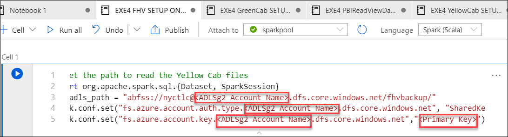
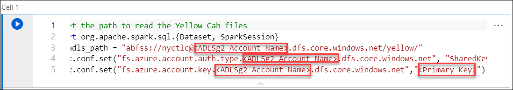
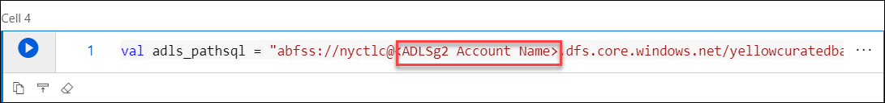
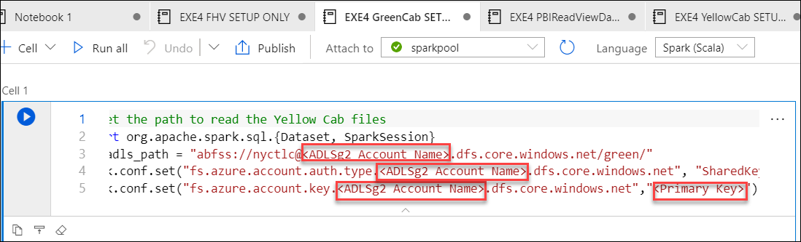
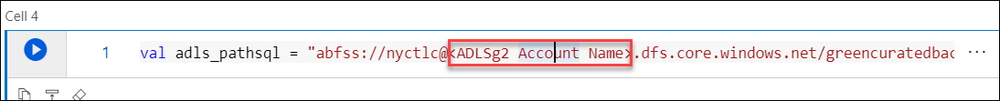
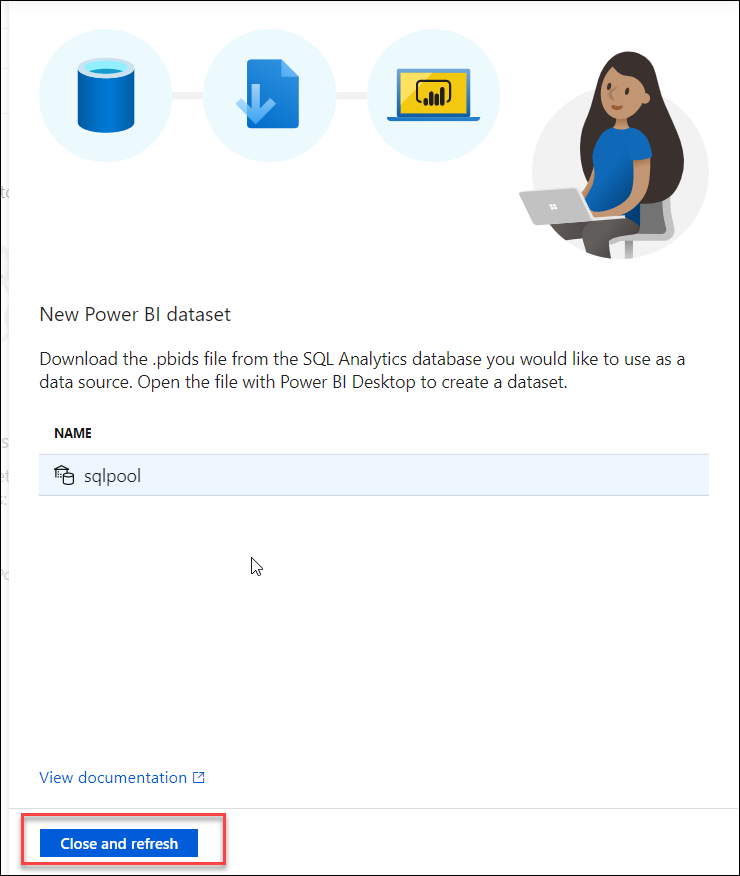

## Exercise 4: Create Pipeline and PowerBI dataset.

Duration: 40 minutes

### Task 1: Create the pipeline.

1. Create Pipeline **EXE4CopyDatatoSQL** by navigating to **Orchestrate** section followed by **+** and then Click on Pipeline.

   
  
2. Name the Pipeline **EXE4CopyDatatoSQL**

   
   
3. Browse to **C:\LabFiles\Building-an-end-to-end-analytics-pipeline-in-Microsoft-Azure-master\labfiles\EXE4CopyDatatoSQL.json**
   Open the file in the notepad and **copy the code** as you will be using it in the next step.
   
4. Now click on **Code** on the right corner of the page and paste the code that you copied in the previous step and click on **OK**. 
   Then click on **Validate** to check if there are any errors and **Publish**

   
   
5. **Don't run the pipeline now**,You will be doing it in the further exercises.
   
### Task 2: Curate the  Yellow, Green Cab and FHV

1. Navigate to **Develop**->**Notebooks**

2. EXE 4 FHV SETUP ONLY, EXE 4 YellowCab SETUP ONLY and EXE 4 GreenCab SETUP ONLY are the notebooks which you imported in previous exercise.

3. Description of the notebooks
   - **EXE4 FHV SETUP ONLY** notebook copies the data from **fhvbackup** folder to **fhv** 
   - **EXE4 YellowCab SETUP ONLY** copies the data from **yellow** folder to **yellowcuratedbackup**
   - **EXE4 GreenCab SETUP ONLY** copies the data from **green** folder to **greencuratedbackup** 

4. Follow the instructions in the notebook **EXE4 FHV SETUP ONLY** 

  - **Replace the Storage account name from the environment details page along with primary key in cell 1** 
  -   To get the value of **Primary key**, navigate to Storage account ->Access keys->Copy the value of key 1
  
      

 - **Replace the storage account name in cell 3** from the environment details page and then Click on **Run** to execute the notebook **EXE4 FHV SETUP ONLY**
    
     
 
5. Follow the instructions in the notebook **EXE4 YellowCab SETUP ONLY**
 
  - **Replace the Storage account name along with primary key in cell 1** 
  -   To get the value of **Primary key**, navigate to Storage account from azure portal->Access keys->Copy the value of key 1

      

  - **Replace the storage account name in cell 4** and then Click on **Run** to execute the notebook **EXE4 YellowCab SETUP ONLY**
     
     

6. Follow the instructions in the notebook **EXE4 GreenCab SETUP ONLY**
  
  - **Replace the Storage account name along with primary key in cell 1** 
  
  -   To get the value of **Primary key**, navigate to Storage account from azure portal->Access keys->Copy the value of key 1

      

  - **Replace the storage account name in cell 3** and then Click on **Run** to execute the notebook **EXE4 GreenCab SETUP ONLY**
   
      
      
7. **Publish** to save the changes.

### Task 3: Create the PowerBI dataset.

1. Upload **Marketsharepbiview_PBI.csv** into the **tempdata** folder by clicking on **Data** on the Left Pane, then Select **tempdata**    container and then click on **Upload**.

   

2. Browse for **Marketsharepbiview_PBI.csv** ,navigate to **C:\LabFiles\Building-an-end-to-end-analytics-pipeline-in-Microsoft-Azure master\labfiles\Marketsharepbiview_PBI.csv** and Select the file Marketsharepbiview_PBI.csv then select **upload** button followed by **Done**.

   

3. Navigate to **Develop->Notebooks** on the left Pane and then Open the Notebook **EXE4 PBIReadViewDataIntoSQLPool**
   
4. In the notebook **EXE4 PBIReadViewDataIntoSQLPool** ,**Update the ADLS storage account name in Cell 1 and Cell 3** and Click on **Run All** and **Publish** the changes.

   

5. Navigate to **Develop** on the left pane and click on **Power BI datasets** under the **Power BI **. Then Click on **+ New Power BI dataset.**

   

6. Click on **Start** 

   

7. Select **sql pool** and click on **Continue**
   
   
   
8. Download the .pbids file

   

9. Open the downloaded file in the Power BI desktop and Log into the Power BI Desktop using Microsoft Account and **sign-in**. Then click on **Connect**

    

10. Select **Marketsharepbiview_PBI** and then click on **Load**. Click on **Ok** if a dialog box of Connection Settings appears.

    

11. Wait until the data loading process is completed ,After the data loading is completed do the following:
    - A dialog box appears to save the report, Save the report as **PBILabxxxxxx** to the VM before publishing the report where xxxxxx is the unique deployment ID ,Copy the deployment id from the environment details page and ensure to replace xxxxxx with Deployment ID.
    - And then Click on **Publish** ->**Publish to PowerBI**. This will publish the report to Power BI workspace that is linked to your Synapse workspace.

    

12. Ensure you publish the report to Power BI Workspace created by you. Select the **labignitePBIxxxxxx** then click on **Select**. And wait until publishing completes and Click on **Got it**.

    

13. Return to the Synapse Workspace and then click on **Close and refresh**

    
    
    Click **Next** to go to the next exercise.

   
