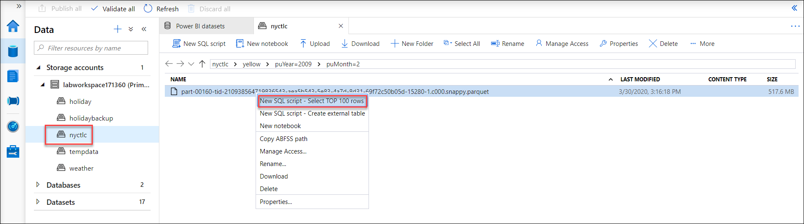
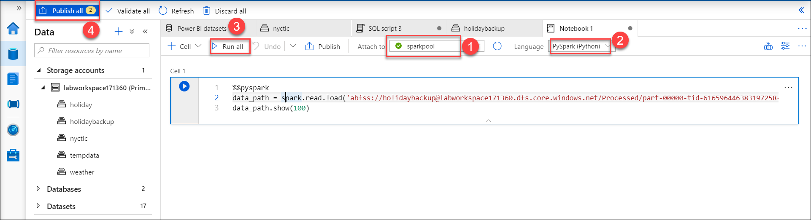

## Exercise 5: Explore the lake with SQL On-Demand and Spark

Duration: 10 minutes

This section will highlight how you can explore data using the engine of your choice.
   
### Task 1: Explore the lake with SQL On-Demand
   
- In this task, you will browse your data lake storage.
   
1. Navigate to **Data>Storage account**.

2. Select **nyctlc** container and **Yellow** folder ,**select the year and month** folder of your choice and then **select a file**, right click and select **New SQL script-Select Top 100 rows**. A script will be automatically generated. 

   
   
3. Connect to **sqlondemand**

4. **Run** this script to see how SQL on demand queries the file and returns the first 100 rows of that file with the header allowing you to easily explore data in the file.

### Task 2: Explore the lake and create a table with Spark

1. Similarly, go to the folder **holidaybackup/processed**. 

2. Select the file in **holidaybackup/processed** and right click to create a **New Notebook**. This will generate a notebook with PySpark code to load the data in a dataframe and displays 100 rows with the header. 

3. Attach the notebook to a **Spark pool** and Click on **run** to execute the command.

   
   
4.  After performing task 1 and task 2 click on **Publish All** at the top left corner.

   Click **Next** to go to the next exercise.
