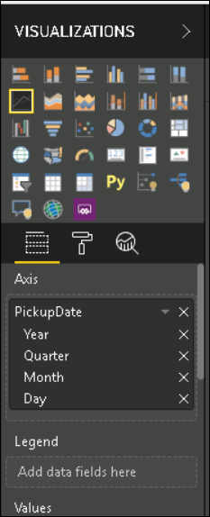
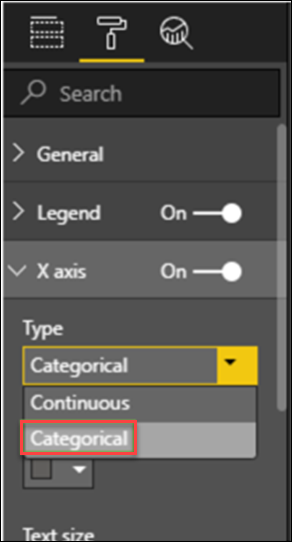
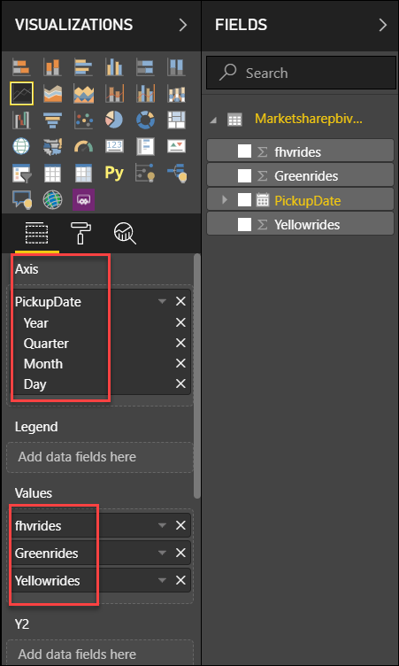

## Exercise 7: Power BI Integration

Duration: 10 minutes

In this exercise you will be able to create a Power BI Report and build a visualization within Synapse Analytics leveraging previously created datasets.

### Task 1: Create a Power BI Report

1. Click on the existing Power BI Report within the synapse workpsace.

  - Navigate to Develop->Power BI->PowerBI report and select the PowerBI report that you created in previous exercises.
  
    

2. The Power BI Report Builder will appear, You can now build your report based on the Imported SQL Dataset.

   

3. Select the **Line Chart** from visualizations 

   

4. Under the X Axis select the type as **categorical**

   
   
5. Drag and drop the **PickupDate** into the **Axis** and the other fields(fhvrides,yellowrides,greenrides) into the **Values** and then adjust the report

   

6. You will now get your report

   

7. You can save the report by clicking on to File->**Save the Report** to the Workspace, You can view the report in both Synapse workspace and PowerBI

   
   
   Click **Next** to go to the next exercise.

