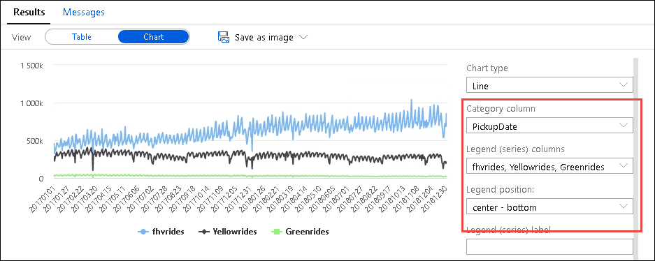
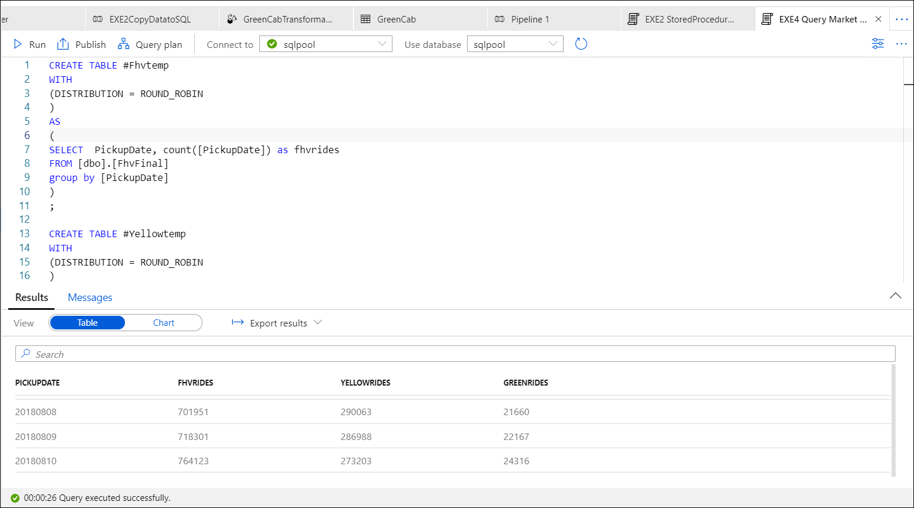

## Exercise 8: High Performance Analysis with SQL Analytics Pool

Duration: 10 minutes

### Task 1: SQL Pool query to understand market shares between cab companies

   **Note:** Make sure the pipeline **EXE4CopyDatatoSQL** executed in Exercise 6 must be completed/succeeded before running the script  **EXE8 Query Market Share** ,note that if the pipeline is not executed errors will occur while you run the script **EXE8 Query Market Share** as the tables may not yet be created which is the role of the store procedures.

1. The SQL Script **EXE8 Query Market Share** will be a simple exercise to understand the evolution over the time of the amounts of daily rides of the yellow cabs, green cabs and for hire vehicle (includes companies like Uber and Lyft) served in New York.

2. **Example**:You can run a query that will aggregate the count of rides per day for each view and join these three views together per day and display the results in a chart.

 - Select the SQL Script **EXE8 Query Market Share** from **Develop->SQL Scripts** section and run the script against the **SQL Pool** database.
 - Select **Chart** from the results
 - Select Chart Type as **Line**
 - Select PickupDate for the Category column
 - Select fhvrides,Yellowrides and Greenrides for the Legend(series) Columns.
 
   
   
   

### Task 2: Monitor the queries through the DMV

- Monitoring the queries that run in SQL Analytics Pool is very simple. You can look at the queries that have run in your SQL Pool.

1. Select **EXE8 Monitor queries** SQL Script from **Develop->SQL Scripts** section

2. **Run** the script against the SQL Pool database.
   
   Click **Next** to go to the next exercise.
