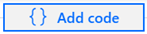

## Exercise 9: Data Science with Spark

## Task 1: Predict NYC Taxi Tips using Spark ML and Azure Open Datasets

Duration: 30 minutes

In this exercise you will play the role of a Data Scientist that based on the NYC Yellow Cab Dataset (that tracks trips and various attributes) using Synapse Notebook creates a model to predict for a given trip whether there will be a trip or not.

1. You can create your own new Notebook by following these steps:

 - Configure and author your notebook:
 - Attach your Spark Compute
 - Select Spark as a language: **Pyspark**
 - Click on **Add text** or **{} Add code** for each cell below:

   For text cell:

   

   For code cell:

   

2. Or run the notebook **EXE9 Data Science Final_PySpark** from the **Develop** section .Note that you will need to **replace the ADLS G2 Storage account** wherever required with the **Storage account** that you are using for the lab.

3. The notebook **EXE9 Data Science Final_PySpark** ingests, visualizes, prepares and then trains a model based on an Open Dataset that tracks NYC Yellow Taxi trips and various attributes around them.

- The goal is to predict for a given trip whether there will be a tip or not.

Once you execute all the cells in the notebook **EXE9 Data Science Final_PySpark** the lab is completed.
