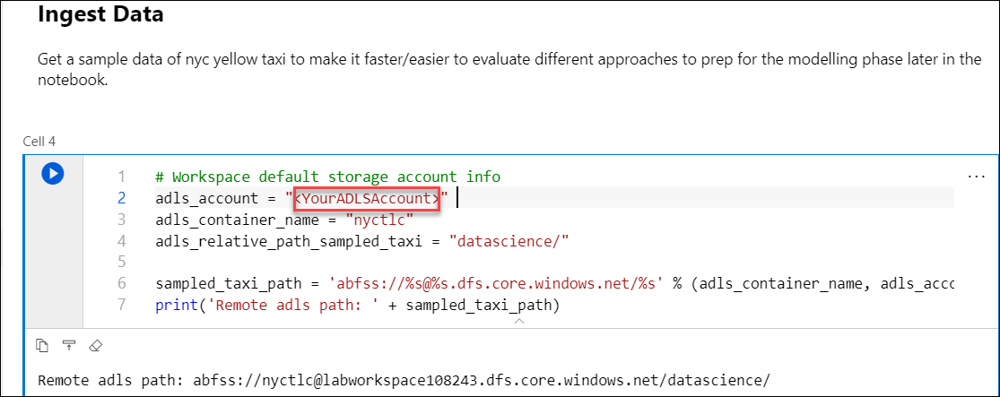

## Exercise 9: Data Science with Spark

## Task 1: Predict NYC Taxi Tips using Spark ML and Azure Open Datasets

Duration: 30 minutes

In this exercise you will play the role of a Data Scientist that based on the NYC Yellow Cab Dataset (that tracks trips and various attributes) using Synapse Notebook creates a model to predict for a given trip whether there will be a tip or not.

1. Navigate to the **Develop** section and Select the notebook **EXE9 Data Science Final_PySpark**.

2. The notebook **EXE9 Data Science Final_PySpark** ingests, visualizes, prepares and then trains a model based on an Open Dataset that tracks NYC Yellow Taxi trips and various attributes around them.

    - The goal of the notebook is to predict for a given trip whether there will be a tip or not.
    
3. Note that you will need to **replace the ADLS G2 Storage account** in cell 4.
   
   

4. Then Click on **Run All** or run the cells one by one to understand each cell in a better way.

5. **Elective** : You can create your own new Notebook by following these steps:

    - Configure and author your notebook:
    - Attach your Spark Compute
    - Select Spark as a language: **Pyspark**
    - Click on **Add text** or **{} Add code** for each cell below:

    To add any text cell click on  Add text:

    

    To create your code cell click on Add code:

    

    Once you execute all the cells in the notebook **EXE9 Data Science Final_PySpark** the lab is completed.
