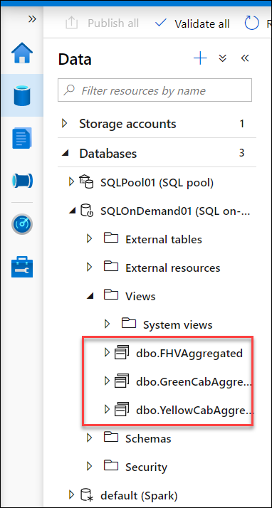

## Exercise 10: Create views with SQL Analytics On-Demand 

In this section, we will look at the same query you ran in a SQL Pool (Exercise 4) but over the Data Lake. If you have not done exercise 8, then this simple exercise is to understand the evolution of over the time of the amounts of daily rides that yellow cabs, green cabs and for hire vehicles (includes companies like Uber and Lyft) served in New York. Performance to query the lake will not be as strong as the query performance in a SQL Pool but SQL Analytics On-Demand is a powerful and flexible capability for data exploration and low cost BI with infrequent access to the lake. No data movement is required.

### Task 1: Create three views over the data lake.
 
1. Select the SQL Script called **EXE5 Create SQL OD Views** from **Develop->SQL Scripts** section.
2. Make sure that script is connected to the SQL on-demand and the SQLOnDEMAND database
3. Replace the storage account name whereever required and  **Run** the script
4. Check that the three views are available (refresh if needed the SQL Analytics On-Demand).

   

5. **Example**: Run a query that will aggregate the count of rides per day for each view and join these three views together per day .Try to display the results in a chart similar to below:

   

 - Run the following SQL Script against SQL On-Demand and the database (not master):
  
  ```
  Select PickupDateYellow,FHVrides,Yellowrides, Greenrides from dbo.YellowCabAggregated
  INNER JOIN dbo.FHVAggregated ON dbo.FHVAggregated.PickupDateFHV=dbo.YellowCabAggregated.PickupDateYellow
  INNER JOIN dbo.GreenCabAggregated ON dbo.GreenCabAggregated.PickupDateGreen = dbo.YellowCabAggregated.PickupDateYellow
  ORDER BY PickupDateFHV ASC
  ```

6. Select Chart

7. From the Y axis columns unselect PickupDateYellow

8. Select PickupDateYellow for the X-Axis column

   Click **Next** to go to the next exercise.
