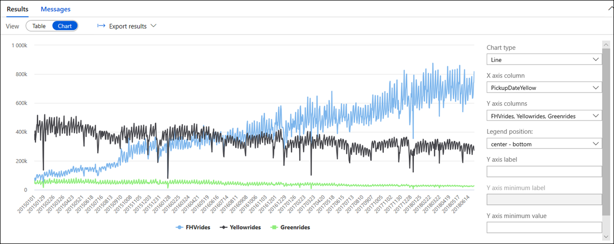

## Exercise 8: High Performance Analysis with SQL Analytics Pool

### Task 1: SQL Pool query to understand market shares between cab companies

1. This query will be a simple exercise to understand the evolution of over the time of the amounts of daily rides that the yellow cabs, green cabs and for hire vehicle (includes companies like Uber and Lyft) served in New York.

2. **Example**:You can run a query that will aggregate the count of rides per day for each view and join these three views together per day. Display the results in a chart similar to below:

   

 - Select the SQL Script **EXE8 Query Market Share**from **Develop->SQL Scripts** section and run the script against the SQL Pool database.
 - Select Chart
 - From the Y axis columns unselect PickupDate
 - Select PickupDate for the X-Axis column

### Task 2: Monitor the queries through the DMV

- Monitoring the queries that run in SQL Analytics Pool is very simple. You can look at the queries that have run in your SQL Pool.

1. Select **EXE8 Monitor queries** SQL Script from **Develop->SQL Scripts** section

2. **Run** the script against the SQL Pool database.
   
   Click **Next** to go to the next exercise.
