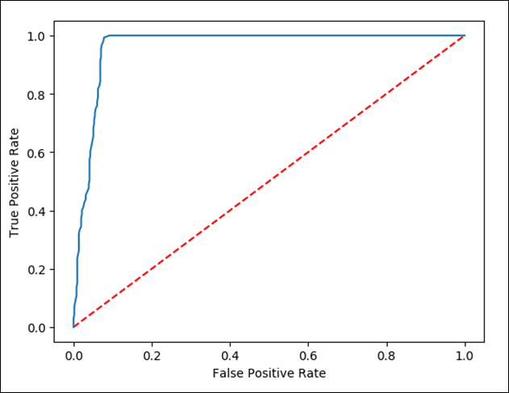

## Exercise 10: Data Science with Spark

In this exercise you will play the role of a Data Scientist that based on the NYC Yellow Cab Dataset (that tracks trips and various attributes) using Synapse Notebook creates a model to predict for a given trip whether there will be a tip or not.

Create a new Notebook.

1. Configure and author your notebook:
 - Attach your Spark Compute
 - Select Spark as a language: **Pyspark**
 - Click on **Add text** or **{} Add code** for each cell below:

   For text cell:

   

   For code cell:

   

## Notebook :Predict NYC Taxi Tips using Spark ML and Azure Open Datasets

- The notebook ingests, visualizes, prepares and then trains a model based on an Open Dataset that tracks NYC Yellow Taxi trips and various attributes around them.

- The goal is to predict for a given trip whether there will be a tip or not.

- The Notebook **EXE6 Data Science Final_PySpark** is uploaded for you in the **Develop** section and rich text is provided to explain every single step. Note that you will need to replace the ADLS G2 Storage account **YourADLSAccount** with your Account name.

- Here’s a summary of the steps you will be performing:

1. **Ingest Data**

   Get the data from the Open Datasets store and then down sample using filtering and sampling to generate a smaller set of data to make  it faster/easier to evaluate different approaches to prep for the modelling phase later in the notebook.

2. **Exploratory Data Analysis**
   Look at the data and evaluate its suitability for use in a model, do this via some basic charts focused on tip values and       relationships.

3. **Data Prep and Featurization**

   It's clear from the visualizations above that there are a bunch of outliers in the data. These will need to be filtered out in addition there are extra variables that are not going to be useful in the model we build at the end.

   Finally there is a need to create some new (derived) variables that will work better with the model.

4. **Data Prep and Featurization Part 2**

   Having created new variables its now possible to drop the columns they were derived from so that the dataframe that goes into the model is the smallest in terms of number of variables, that is required. Also create some more features based on new columns from the first round.

5. **Encoding**

   Different ML alogirthms support different type sof input, for this example Logistic Regression is being used for Binary Classification. This means that any Categorical (string) variables must be converted to numbers.

   The process is not as simple as a "map" style function as the relationship between the numbers can introduce a bias in the resulting model, the approach is to index the variable and then encode using a standard approach called One Hot Encoding.

   This approach requires the encoder to "learn"/fit a model over the data in the Spark instance and then transform based on what was learnt.

6. **Generation of Testing and Training Data Sets**
   
   Simple split, 70% for training and 30% for testing the model. Playing with this ratio may result in different models.

7. **Train the Model**
   Train the Logistic Regression model and then evaluate it using Area under ROC as the metric.
   The ROC is a graphical plot that illustrates the diagnostic ability.
   For our Model the “Area under ROC = 0.989821882951654” and this is considered excellent

8. **Evaluate and Visualize**

    Plot the actual curve to develop a better understanding of the model.
    See the Area under the ROC model:

    
