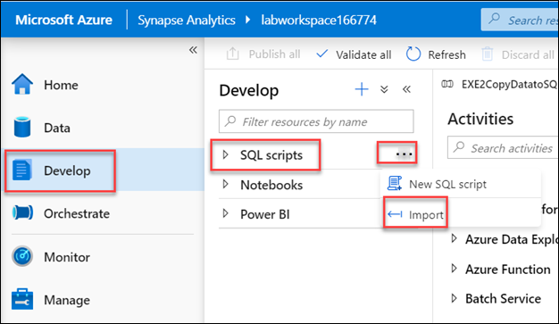

## Exercise 2: Import all the artifacts and set the credentials for SQL Pool and SQL OD in the Synapse Workspace

### Task 1: Import all the SQL scripts and notebooks

1. Import all the **SQL scripts**, Navigate to **Develop** and +Icon then Click on **Import**.

   
   
2. Browse to the folder where the lab files are downloaded.
   - Select the **labfiles** folder then Click on **SQL scripts** folder and select all the SQL scripts to import.
   
3. Import all the **notebooks**.Navigate to **Develop** and +Icon then Click on Import 

   
   
4. Browse to the folder where the lab files are downloaded.
   - Select the **labfiles** folder then Click on **Notebooks** folder and select all the notebooks to import.
   
5. Once you finish importing all the SQL scripts and the notebooks, Click on **publish all** .
   
   
   
### Task 2: Set the credentials for SQL Pool

1. Execute the SQL script **SQLPoolcredentials SETUP ONLY**.
     
    - **SQLPoolcredentials SETUP ONLY** is the SQL script which you imported in task 1.
    - **SQLPoolcredentials SETUP ONLY** SQL script is to assign the role of Database owner to the user.
    - Make sure you **replace the username** with the username you are using for the lab and **connect to sqlpool** not sql on-demand.
    - Click on **Run** and the output should show as command executed successfully.
    - And **publish** the changes.
    
    
    
    
### Task 3: Set the credentials for SQL on-demand
   
1. Execute the SQL script **SQLODStorageCredentials SETUP ONLY**
    
    - **SQLODStorageCredentials SETUP ONLY** is the SQL script which you imported in task 1.
    - Make sure you **replace the Storage account name** that you are using in the lab and **connect to sql on-demand** not sql pool.
    - Click on **Run** and the output should show as command executed successfully.
    - And **publish** the changes.
    
    
  

2. Execute the SQL script **SQLODCredentials SETUP ONLY**   

    - **SQLODCredentials SETUP ONLY** is the SQL script which you imported in the task 1.
    - Make sure you **replace the username** with the username you are using for the lab and **connect to sql on-demand** not sql pool.
    - Click on **Run** and the output should show as command executed successfully.
    - And **publish** the changes.
 
    
    
    Click **Next** to go to the next exercise.
