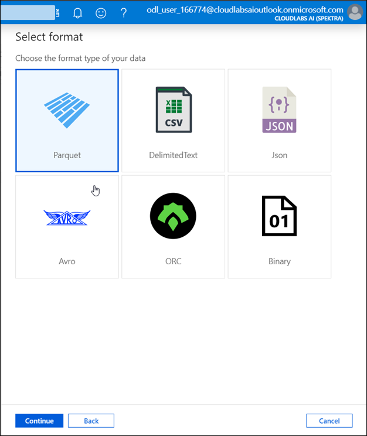
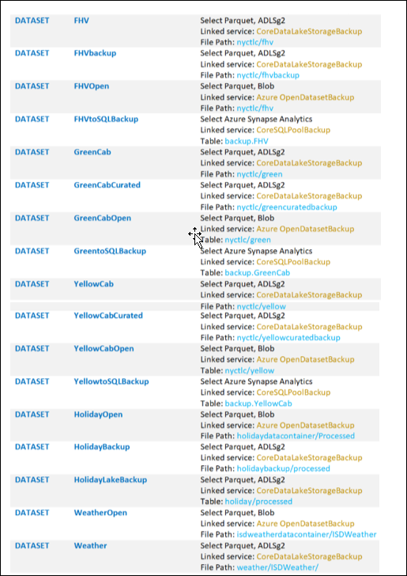

## Exercise 3: Create Schemas, Tables, Stored Procedures and Datasets for SQL Pool.

### Task 1: Create Schemas in SQL Pool.

1. Create **Staging** schema

    - Navigate to **Data**-> Databases ->**SQL Pool**->**Schemas**->**New SQL Script**->**New Schema**
    - **Run** the command **CREATE SCHEMA [Staging]**.
  
    
  
2. Create **Backup** Schema

    - Navigate to **Data**-> Databases ->**SQL Pool**->**Schemas**->**New SQL Script**->**New Schema**
    - **Run** the command **CREATE SCHEMA [Backup]**.
    - **Publish** the changes made after creating both the schemas.
   
   
### Task 2: Create Tables in SQL Pool.
 
 1. Execute the SQL script **CreateStagingBackupTables SETUP ONLY** which you imported in Exercise 2.Make sure you are connected to **sqlpool**
 
 2. Click on **Run**
 
 3. Make sure 5 tables are created.
 
    

 
### Task 3: Create Stored Procedures in SQL Pool.
 
1. Execute the SQL script **CreateStoredProcedures SETUP ONLY** which you imported in Exercise 2.Make sure you are connected to **sqlpool**

2. Click on **Run** 

3. Make sure 7 stored procedures are created

   

### Task 4: Create Datasets for the pipeline.

1. Navigate to Data->Datasets-> **New Dataset**

   

2. Creation of **FHV Dataset**.

   - Search for **ADLS Data Lake Storage Gen 2** and Click on **Continue**.

   

   - Select **Parquet** as format of data and click continue.

   
 
   - Under Set Properties provide the name as **FHV**
   
   - Select the previously created Linked Service **CoreDataLakeStorageBackup**
   
   - Browse to the File Path nyctlc/fhv
   
   - Click on **OK**.The first dataset is now created.
   
   - **Publish** the changes made.

   

2. Similarly create another 16 datasets by following the below list.Publish the changes made or else the datasets won't be reflected.

   

3. Make sure 17 datasets are created.
   
   Click **Next** to go to the next exercise.
