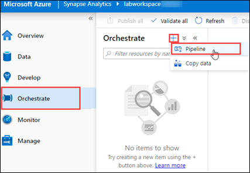
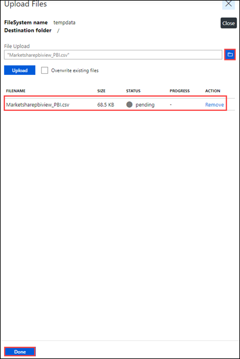
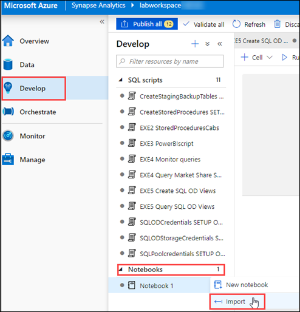
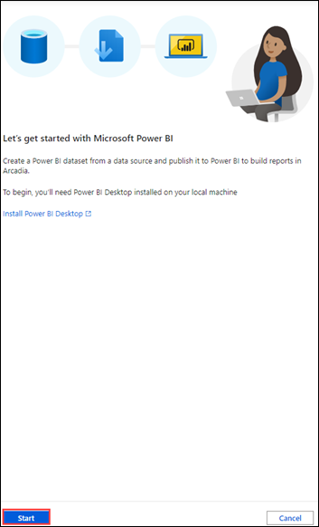
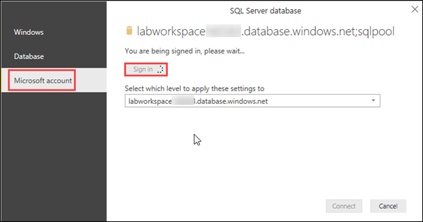
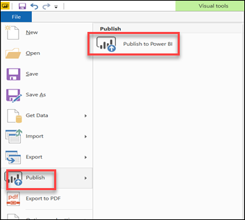
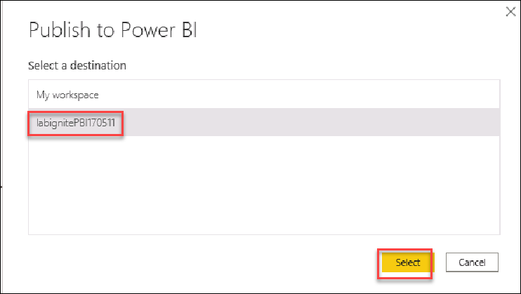

## Exercise 4: Create Pipeline and PowerBI dataset.

### Task 1: Create the pipeline.

1. Create Pipeline **EXE2CopyDatatoSQL** by clicking on **Orchestrate**, then + Icon and click on Pipeline.

   
  
2. Name the Pipeline **Exe2CopyDatatoSQL**

   
   
3. Browse to **C:\LabFiles\Building-an-end-to-end-analytics-pipeline-in-Microsoft-Azure-master\labfiles\EXE2CopyDatatoSQL.json**
   Open the file in the notepad and **copy the code** as you will be using it in the next step.
   
4. Now click on **Code** on the right corner of the page and paste the code that you copied in the previous step and click on **OK**. 
   Then click on **Validate** to check if there any errors and **Publish**

   
   
5. Don't run the pipeline now,You will be doing it in the further exercises.
   
### Task 2: Curate the  Yellow, Green Cab and FHV

1. Navigate to **Develop**->**Notebooks**

2. FHV SETUP ONLY,YellowCab SETUP ONLY and GreenCab SETUP ONLY are the notebooks which you imported in Exercise 2.

3. **FHV SETUP ONLY** notebook copies the data from **fhvbackup** folder to **fhv** whereas **YellowCab SETUP ONLY** copies the data from **yellow** folder to **yellowcuratedbackup** and **GreenCab SETUP ONLY** copies the data from **green** folder to **greencuratedbackup** respectively.

4. Follow the instructions in the notebook **replace the Storage account name in cell 1 and cell 3** , **replace the primary key in cell 1 with the key1 of the storage account** and Click on **Run** to execute the notebook **FHV SETUP ONLY**

5. Follow the instructions in the notebook **replace the Storage account name in cell 1 and cell 4** and Click on **Run** to execute the notebook **YellowCab SETUP ONLY**

6. Follow the instructions in the notebook **replace the Storage account name wherever required** and Click on **Run** to execute the notebook **GreenCab SETUP ONLY**

7. **Publish** to save the changes.

### Task 3: Create the PowerBI dataset.

1. Upload **Marketsharepbiview_PBI.csv** into the **tempdata** folder by clicking on **Data** on the Left Pane, then Select **tempdata**    container and then click on **Upload**.

   

2. Browse for **Marketsharepbiview_PBI.csv** ,navigate to **C:\LabFiles\Building-an-end-to-end-analytics-pipeline-in-Microsoft-Azure master\labfiles\Marketsharepbiview_PBI.csv** and Select the file Marketsharepbiview_PBI.csv then select **upload** button followed by **Done**.

   

3. Click on **Develop->Notebooks** on the left Pane and then import the Notebook **PBIReadViewDataIntoSQLPool**

   

4. Click on **Configure session** on the Right side of the page.

   

5. Configure the session as follows:

   

6. Open the notebook **PBIReadViewDataIntoSQLPool** and **Update the ADLS storage account name in Cell 1 and Cell 3** and Click on **Run All**.

   

7. Navigate to **Develop** on the left pane and click on **Power BI datasets** under the **Power BI Linked service**. Then Click on **+ New Power BI dataset.**

   

8. Click on **Start** on the page that comes up.

   

9. Click on **sqlpool** and then click on Continue.

   

10. Now click on **Download**

    

11. Open the downloaded file in the Power BI desktop and Log into the Power BI Desktop using Microsoft Account and **sign-in**. Then click on **Connect**

    

12. Select **Marketsharepbiview_PBI** and then click on **Load Data**. Click on **Ok** if a dialog box of Connection Settings appears.

    

13. Wait until the data loading process is completed and then Publish your PBI report to the Power BI workspace that is linked to your Synapse workspace.

    

14. Make sure you publish on the PBI Workspace created by you.Click on **Select**.

    

15. Go back to the Synapse Workspace and then click on Finish and refresh

    
    
    Click **Next** to go to the next exercise.

   
