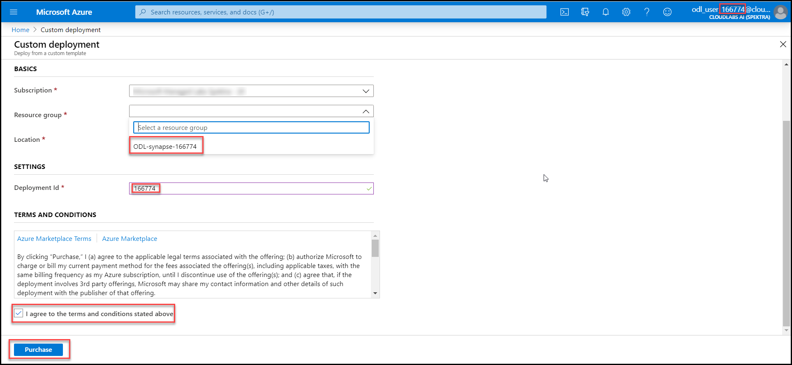
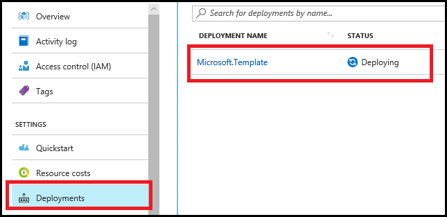

# Building an end-to-end analytics pipeline in Microsoft Azure

## Before the hands-on lab

Duration: 30 minutes

Before initiating the hands-on lab, you will setup an environment to use for the rest of the exercises.

### Task 1: Deploy Lab VM Resources to Azure

1. Select the following **Deploy to Azure** button to deploy the ARM Template with the Lab VM resources for this lab. This link will deep link into the Azure Portal, passing in the ARM Template for deploying the resources for this lab.

    

2. On the **Custom deployment** blade, select the existing resource group **ODL-synapse-XXXXXX** for the **Resource group** field.

3. Provide the **Deployment Id** ,you will find it at the right top corner of azure portal.

    

4. Check the **I agree to the terms and conditions stated above** checkbox.

5. Select **Purchase**.

6. The deployment will take 15-30 minutes to complete. Continue to the next Task while this is deploying.

    To view the progress, select the **Deployments** link, then select the **Microsoft.Template** deployment.

    

7. The deployment will take around 10 minutes to complete.

8. You should follow all the steps provided *before* performing the Hands-on lab.
